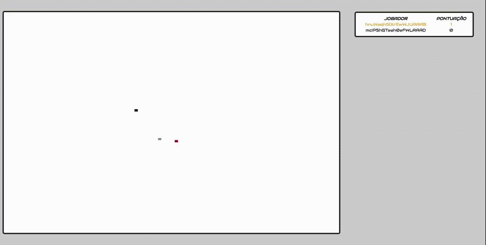

# 🍓 Pegue a fruta

## 🎯 Jogue agora
Disponível [aqui](https://catch-fruits.herokuapp.com/ "https://catch-fruits.herokuapp.com/")

## 🚀   Tecnologias:
Esse projeto foi desenvolvido com as seguintes tecnologias:
- HTML 5
- JavaScript
- CSS 3
- NodeJS
- Socket.io

## 📝 Licença
Esse projeto está sob a licença MIT. Veja o arquivo  [LICENSE](https://github.com/lmiguelm/catch-fruits/blob/master/LICENSE.md) para mais detalhes.
